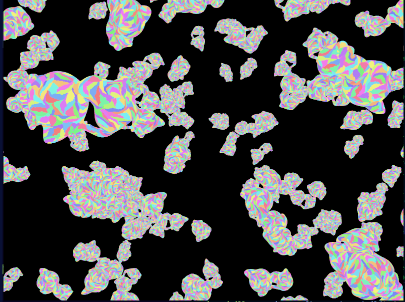
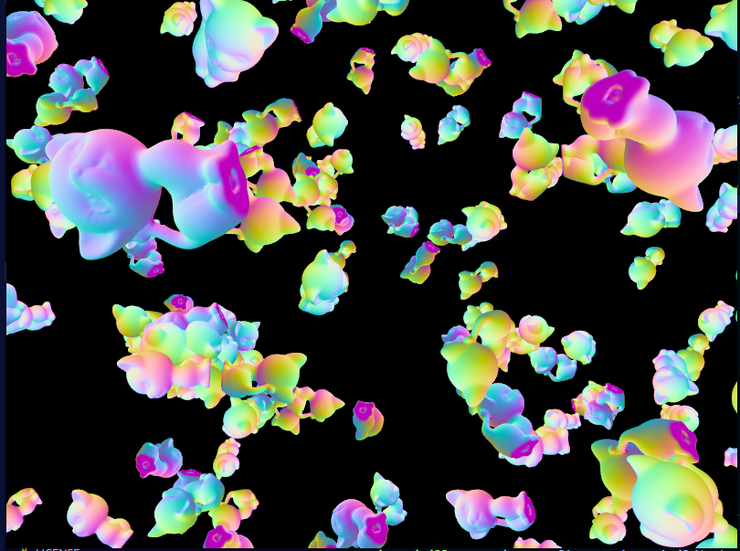

# GPU-Driven Vulkan Renderer

A GPU-driven rendering engine using Vulkan with mesh shading pipeline, custom culling, and SPIR-V reflection.

## Features

- Mesh shaders with task shader culling
- Frustum culling, backface cone culling, Hi-Z occlusion culling
- 5.8x speedup over traditional vertex pipeline (93ms → 16ms, 1000 Buddha models, each with 1M triangles, 11K meshlets)
- Forsyth vertex cache optimization (35% improvement)
- SPIR-V reflection for automatic descriptor set layout generation
- Multi-draw Indirect

## Notes
There are a couple of interesting things I discovered during the development.
> First of all, my initial idea was to implement Forsyth algorithm to softly enforce meshlet spatial locality AND optimize vertex cache utilization. This was supposed to let me greedily build my meshlets in a simple algorithm. This idea failed miserably for multiple reasons. The original Forsyth algorithm looks for the next best triangle among all unprocessed triangles, which means the algorithm might pick two completely unrelated triangles and store them next to each other, as it entirely depends on what kind of geometry was passed in. This can actually be mitigated to some extent by slightly changing the algorithm: instead of looking for the next best triangle among all triangles, we only consider triangles which have vertices in the simulated cache. The idea is that if the vertex is in the cache, it has been used recently, so reusing it and storing the triangle that uses such vertices would enforce spatial locality. Though the idea seemed clever to me, I didn't account for the fact that the geometry might have isolated triangles, and in fact there are a lot of them. During vertex deduplication, we treat vertices with the same geometrical positions differently if their other attributes differ (i.e normals might be different), which leads to the geometry having isolated triangles, or even isolated regions. This means that the Forsyth algorithm would store a lot of isolated triangles at the very beginning of the index buffer, creating a group (or just one in the best case scenario) of discountiguous meshlets. This messes up ALL culling. Now, we might be able to add a third scoring parameter to score triangles: distance between previous triangle's centroid to the centroid of the candidate triangle. This might mess up the cache utilization, although it depends how important we make this heuristics.

> Funny enough, this slightly changed Forsyth algorithm does try to enforce spatial locality, although the meshlets we see are not the pretties to be honesy. They are pretty elongated and don't really grow in a breadth-first manner. This might lead to inconsistent results for cone culling.

> Another important thing is that this version of the Forsyth algorithm enforces "soft" spatial locality, as in triangles in a meshlet might be vertex-connected, not edge-connected. This is definitely not what is usually expected.

> Secondly, cone culling is a very weird concept in practice. We cull meshlets that are facing away from the camera, which sounds fair, but the results are pretty inconsistent and depend a lot on the geometry. For low-poly geometry, meshlet's cone might be too wide, which doesn't let us cull it. On the other hand, for high poly geometry the details (which are represented using normal mapping in rendering) are represented using lots of triangles, so a small piece of the mesh might have a very weird-looking meshlet with a very wide cone. So, what can we cull? From my tests, it really depends on the mesh itself, but since cone testing is super cheap, it doesn't hurt to include it every time.

> Third, occlusion culling is done here in a separate pass, which completely kills its purpose. I did it since my meshes are transformnig in real time, as in they are not static. I could have used the previous frame's depth buffer to create Hi-Z pyramid, but then I would need to use motion vectors, and I didn't want to study that part. First of all, building the pyramid is rather simple, but writing the culling logic is pretty confusing since we need to convert everything to clip-space, and then to NDC, and then to texture-space. Moreover, it doesn't produce much performance boost: we pay the cost of building geometry twice in exchanging for processing less triangles later, and using less fragment shader. The problem is, the fragment shader is so simple it doesn't justify using occlusion culling, but it was a fun learning experiencce.